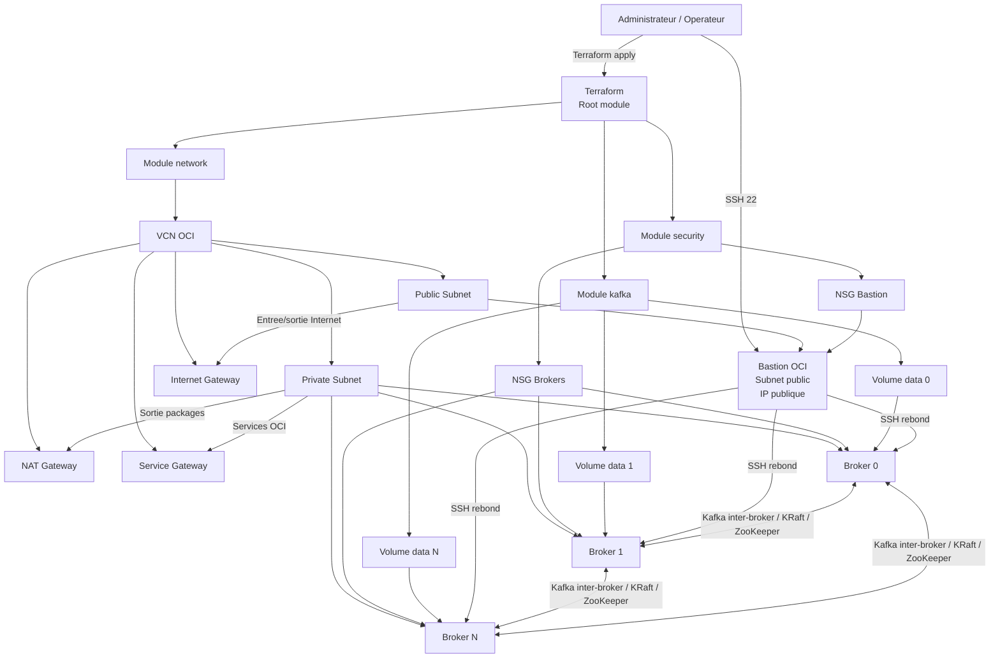

# Schema d'architecture Kafka

Ce document decrit l'architecture deploiyee par Terraform dans ce projet.

## Vue d'ensemble

## Composants principaux

- `network` cree le VCN, les subnets, les gateways, les route tables et les security lists.
- `security` cree les NSG pour le bastion et les brokers Kafka.
- `kafka` cree les instances brokers, les volumes de donnees, le bastion optionnel et le bootstrap des services.

## Flux principaux

- Acces administration: Internet vers bastion, puis SSH vers les brokers.
- Acces Kafka: clients internes vers les brokers sur le port `9092`.
- Communication interne du cluster: ports KRaft ou ZooKeeper selon le mode deploye.
- Sortie reseau des brokers: NAT Gateway pour paquets, Service Gateway pour services OCI.
